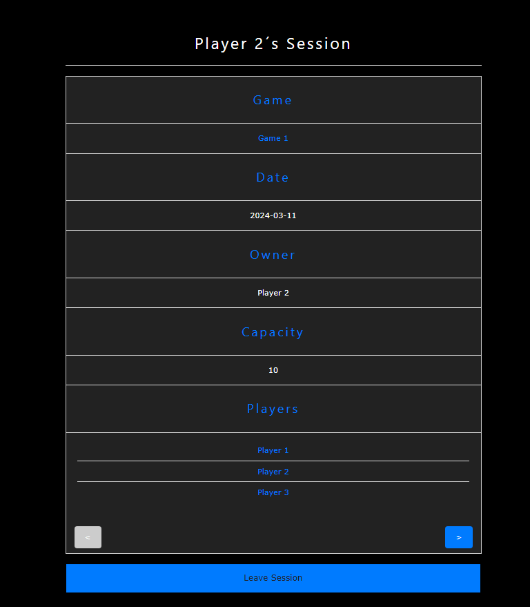

# Session_Manager
### Project made in 4º Semester of Computer Engineering Degree on Isel.
- Software Laboratory, 2023/2024, Spring semester.

# Introduction

---

This project was developed for the Software Laboratory course.

The main goal of this project is to develop an application that allows the user to
manage sessions of a game and the players that will join this session.

The application should allow the user to:
- create: Players, Games and Sessions.
- read: Players, Games and Sessions.
- Update: Sessions.

The application should also allow the user to filter the Games and Sessions
by their properties like gid, sid, genre, developer, etc.

---

# Modeling the database

In this section, we will describe the conceptual and physical models of the database used in the application.

The database is designed to manage game sessions and players. It includes tables for players, games, sessions, and their relationships. The main tables are:

- `PLAYER`: Stores player information such as `pid`, `name`, `username`, `email`, `password`, and `token`.
- `GAME`: Stores game information such as `gid`, `name`, and `developer`.
- `SESSION`: Stores session information such as `sid`, `capacity`, `gid`, `date`, and `owner`.
- `PLAYER_SESSION`: Stores the relationship between players and sessions.

Triggers and functions are used to enforce business rules and maintain data integrity. For example,
triggers ensure that the session capacity is not exceeded and that players are added to sessions correctly.

The physical model of the database is implemented in PostgreSQL, and the SQL scripts for creating the schema,
functions, and triggers are provided in the `src/main/sql` directory.

---

## Conceptual Model

The following diagram holds the Entity-Relationship model for the information managed by the system.

---

### DomainDiagram:


---

### InfoDiagram:


---

### ErrorDiagram:


---

### StorageDiagram:


---

### ServicesDiagram:


---

### WebApiDiagram:


---

### PackageDiagram:


---
### We highlight the following aspects:
- The domain classes are made with Data classes.
- The domain classes are immutable.
- The domain classes have a constructor that receives all the properties.
- Besides the domain classes, all the other classes implement interfaces.
- The interfaces implement the methods that are necessary for each application module,
  making a contract for the classes that implement them.

---

### The conceptual model has the following restrictions:
- An email is unique for each player.
  And should follow a specific pattern.
- A game has a unique identifier (gid) and a name.
- A session has a unique identifier (sid) and a date.
- A player has a unique identifier (pid) and a name.

---

## Physical Model

The physical model of the database is available in [SQL script](phase4/src/main/sql).

---

### We highlight the following aspects of this model:
- The database is implemented in PostGreSQL.
- The database has three main tables: Players, Games and Sessions.
- The restriction of unique email, unique pid, gid and sid are implemented in the database.

---

# Software organization

---

## Web page

The [web page](https://service-ls-2324-2-43d-g08.onrender.com) is the interface that the user will use to interact with the application.
- https://service-ls-2324-2-43d-g08.onrender.com

# Web Application User Guide

## Introduction

The web application is designed to manage game sessions and the players who join or own these sessions.

It provides functionalities to create, read, and update game sessions, games, and players.  The application has a user-friendly interface that includes a home page and a navigation menu for easy access to different parts of the application. Users can create a new game session, join an existing game session, view and filter game sessions, and update the details of a game session.

## Getting Started

### System Requirements

Currently, the application is only available as a web application, so you will need a web browser to access it. The application is compatible with most modern web browsers, including Chrome, Firefox, and Safari.

### Installation

There is no installation required to use the web application. Open your web browser and navigate to the application's URL to access it.

### Login/Registration

The application currently doesn't have a login or registration system, so you can start using the application right away without any credentials. We plan to implement a login system in the future.

## Navigating the Interface

The web application has a simple and intuitive interface that allows users to easily access the main features of the application.

### Login Page

<div align="center">
    
</div>

### Registration Page

<div align="center">
    
</div>

### Home Page
<div align="center">
    
</div>

The home page is the main landing page of the application. It provides information of the current user such as the name, username, and email. It also displays two buttons:
- Your sessions: when clicked it will show the sessions that the user is part of.
- Choose a game to create a session: when clicked it will redirect the user to the search games page so the user can choose a game to create a session.

### Navigation Menu

<div align="center">
    
</div>

The navigation menu is located at the left of the page and provides links to different parts of the application. The menu includes the following options:

### Change Theme Button

<div align="center">
    
</div>

The change theme button allows the user to change the theme of the application. The application has two themes: light and dark. Clicking the button will toggle between the two themes.

- Home: navigates to the home page.

<div align="center">
    
</div>

- Search Games: navigates to the search games page where the user can search for games.

<div align="center">
    
</div>

- Search Sessions: navigates to the search sessions page where the user can search for sessions.

<div align="center">
    
</div>

- Search players: navigates to the search player page where the user can search for players.

<div align="center">
    
</div>

- Contact: navigates to the contact page where the user can contact the developers.

<div align="center">
    
</div>

### Search Games Page

<div align="center">
    
</div>

The search games page allows users to search for games by name, genre, or developer. Users can filter the games by entering the search criteria and clicking the "Search" button. Users can also click on the "Create Game" button to create a new game.

### Game Search Results Page

<div align="center">
    
</div>

The search results page displays the list of games that match the search criteria. Users can click on a game to view the game details.

### Game Details Page

<div align="center">
    
</div>

The game details page displays the details of a game, such as the name, genre, and developer. The page also has the button "Sessions" to see the list of sessions of the game. The "Create Session" button allows the user to create a session for the game.

### Create Game Page

<div align="center">
    
</div>

The create game page allows users to create a new game by entering the game's name, genre, and developer. After entering the game details, users can click the "Create" button to create the game. Note: The "Create" button will only be enabled if all the required fields are filled.


### Search Sessions Page

<div align="center">
    
</div>

The search sessions page allows users to search for game sessions by game, date, state, or player. Users can filter the sessions by entering the search criteria and clicking the "Search" button.

### Session Search Results Page

<div align="center">
    
</div>

The search results page displays the list of sessions that match the search criteria. Users can click on a session to view the session details.

### Session Details Page

<div align="center">
    
</div>

The session details page displays the details of a game session, such as the date, capacity, game and list of players in the session. If the user is the owner of the session, they can update or delete the session. If the user is not the owner of the session, they can join or leave the session.

### Create Session Page

<div align="center">
    
</div>

The create session page allows users to create a new game session by entering the session details, such as the date and capacity. After entering the session details, users can click the "Create" button to create the session. Note: The "Create" button will only be enabled if all the required fields are filled.

### Search Players Page

<div align="center">
    
</div>

The search players page allows users to search for players by username.

### Player Details Page

<div align="center">
    
</div>

The player details page displays the details of a player, such as the name, username and email. The page also has the button "View Player´s Sessions" to see the list of sessions that the player is part of.

### Contact Page

<div align="center">
    
</div>

The contact page allows users to contact the developers by sending a mail. The page also provides links to the developers' social media profiles.


## Using the Features

The web application provides several features that allow users to manage game sessions and players.

### Creating a Game Session

To create a new game session, follow these steps:
- Go to the home page.
- Click on the "Choose a game to create a session" button.
- Search for the game you want to create a session for.
- Click on the "Create Session" button next to the game.
- Enter the session details, such as the date and capacity.
- Click on the "Create" button to create the session.
- You will be redirected to the session details page, where you can view the session details.

### Joining a Game Session

To join an existing game session, follow these steps:
- Go to the search sessions page.
- Search for the session you want to join.
- Click on the "Join" button next to the session.

### Leaving a Game Session

To leave a game session, follow these steps:
- Go to the home page.
- Click on the "Your sessions" button.
- Click on the session you want to leave.
- Click on the "Leave" button to leave the session.
- Note: Only players who are part of the session can leave the session.
- Note: The session owner cannot leave the session, but they can delete the session. To see how to delete a session, see the next section.

### Deleting a Game Session

To delete a game session, follow these steps:
- Go to the home page.
- Click on the "Your sessions" button.
- Click on the session you want to delete.
- Click on the "Delete" button to delete the session.
- Note: Only the session owner can delete the session.
- Note: Deleting a session will remove all players from the session.
- Note: Once a session is deleted, it cannot be recovered.

### Viewing Game Sessions

To view game sessions, follow these steps:
- Go to the search sessions page.
- You can filter the sessions by game, date, state or player.
- Click on the "Search" button to view the filtered sessions.
- You will be redirected to the search results page, where you can view the sessions that match your filter.
- After you choose a session you will be redirected to the session details page where you can see the session details such as date, capacity, and game.

### Updating a Game Session

To update a game session, follow these steps:
- Go to the home page.
- Click on the "Your sessions" button.
- Click on the session you want to update.
- Click on the "Update" button.
- Enter the new session details.
- Click on the "Update" button to save the changes.
- Note: Only the session owner can update the session details.

### Viewing Player Details

To view player details, follow these steps:
- Go to the search players page.
- Search for the player you want to view.
- You will be redirected to the player details page, where you can view the player's details.

### Viewing your own details

To view your own details, follow these steps:
- Go to the home page.
- You will be able to see your name, username, and email.
- You can also see the sessions you are part of by clicking on the "Your sessions" button.

### Searching for Games

To search for games, follow these steps:
- Go to the search games page.
- Filter the games by name, genre, or developer.
- To choose a genre, click on the insert genre input and select the genre you want, after this click on the add button. to add the genre to the filter. If you want to remove a genre from the filter click on it on the genres selected list.
- Click on the "Search" button to view the filtered games.
- You will be redirected to the search results page, where you can view the games that match your filter.
- After you choose a game you will be redirected to the game details page where you can see the game details such as name, genre, and developer.

### Creating a game

To create a game, follow these steps:
- Go to the search games page.
- Click on the "Create Game" button.
- Similar to the searching games page, introduce the game's name, genre, and developer.
- Click on the "Create" button to create the game.
- You will be redirected to the game details page, where you can view the game details that you just created.

### Contacting the Developers

To contact the developers, follow these steps:
- Go to the contact page.
- Click the "Contact" button to send a message to the developers.
- You can also click on the social media icons to find us on social media.

## Troubleshooting

If you encounter any issues while using the web application, please contact the developers using the contact page. We will do our best to resolve any issues as soon as possible.

---
## Open-API Specification
- [YAML file](documentation/SessionAppApi.yml)
---
### In our Open-API specification, we highlight the following aspects:

- The API should be able to create, read, players, games and sessions.
- The API should be able to update a session.
- The API should be able to filter games and sessions by their properties.
- To make any read or update request through the API, the user should provide the token.

---

## Request Details

---
### Request Processing

#### 1. Client Request
- A client initiates a request by sending an HTTP request to the server, containing relevant headersBuilder,
  parameters, and possibly a request body.

#### 2. Routing
- The server's routing system intercepts the incoming request and directs it to the appropriate endpoint
  based on the URL path and HTTP method.

#### 3. Handler Initialization
- Upon routing, the appropriate handler for the endpoint is initialized.
  Handlers encapsulate the logic for processing specific types of requests related to players,
  games, or sessions.

#### 4. Authentication and Authorization
- Before processing the request, the system authenticates and authorizes
  the user's access to the requested resource. This step ensures that only
  authorized users can perform certain actions.

#### 5. Request Parsing and Validation
- Request parameters are parsed and extracted from the request object.
  After that, they are validated to ensure they adhere to defined criteria
  and the objective of the requested application.

#### 6. Response Generation
- Based on the outcome of program execution, an appropriate response is
  generated. Responses include an HTTP status code, response headersBuilder, and
  possibly a response body containing data or error messages.

---

### Internal Components for Request Handling

#### 1. RoutingHttpHandler
- This function constructs the routing HTTP handler for the
  application services.

1. It initializes storage and service elements and handlers necessary
   for request processing.
2. The function returns the routing handler configured with appropriate endpoints and handlers

#### 2. Handler Classes and its Corresponding Interfaces
- Handler classes (PlayerHandler, GameHandler, and SessionHandler)
  are responsible for processing requests related to players, games,
  and sessions, respectively.
- These classes implement interfaces defining the contract for request handling.
- Methods within those classes perform specific actions based on the received request.

#### 3. Other Request/Response Processing Functions

- readBody
    - Read the body of a request and return it as a map.
- unauthorizedAccess
    - Verifies if the request has a valid token.
- tryResponse
    - Creates a response with a given status and message, and if
      an exception occurs, the response will have the given status and message.
- makeResponse
    - Creates a response with a given status and message.

---

### Request Parameter Validation

#### Where are the Requests Validated?
- They are validated in every handler class made
  (PlayerHandler, GameHandler and SessionHandler).

#### How are the Requests Validated?
- In every method of all the handler classes, the parameters
  necessary are extracted from the query or the body of the request.
- After that, there are verifications to conclude if all the necessary
  parameters were passed correctly. If that's not the case, a response with
  the status *Bad Request* is sent to the client.


## Connection Management and Transaction Scopes

### 1. Connection Between Client and Server
- The client initiates communication by sending an HTTP request to the server.
- The server listens for incoming requests on a specified port and establishes
  a connection upon receiving a request.
- In this application, we use the library [http4k](https://www.http4k.org/) to make the connection between
  Client and Server possible.

### 2. Connection Between Server and Database
#### Connection Establishment:
- The storage classes initialize a *PGSimpleDataSource*, which represents
  the PostgresSQL data source used for database connections.
- The data source is configured with the database URL obtained from the environment
  variable specified during initialization.

#### Transaction Scopes:
- Using the *executeCommand* extension function defined for the *Connection*
  class on every method of the storage modules, it's possible to execute SQL
  queries safely.
- This happens because the executeCommand function disables auto-commit mode
  on the connection, allowing multiple SQL statements to be executed as part of
  the same transaction scope.
- If an exception occurs during command execution, the connection is rolled back
  to its previous state, ensuring that any changes made within the transaction are
  undone.
- Upon successful execution of the command, the transaction is committed,
  persisting the changes made within the transaction to the database.

---

## Data Access

The data access is handled in the storage the executeCommand function disables auto-commit mode on the connection, allowing multiple SQL statements to be executed as part of the same transaction scope.
If an exception occurs during command execution, the connection is rolled back to its previous state, ensuring that any changes made within the transaction are undone.
Upon successful execution of the command, the transaction is committed, persisting the changes made within the transaction to the database module, using a connection to make any query or update.

### the main SQL statements used are:

---
- to create a game:
```sql
INSERT INTO GAME(name, developer) VALUES (?, ?);
INSERT INTO GENRE(name) VALUES (?) ON CONFLICT DO NOTHING;
INSERT INTO GAME_GENRE(gid, genre) VALUES (?, ?)
```
---
- to read a game:
```sql
SELECT gid, name, developer FROM GAME WHERE gid = ?;
SELECT name FROM GENRE JOIN GAME_GENRE ON GENRE.name = GAME_GENRE.genre WHERE GAME_GENRE.gid = ?
```
---
- to read a game by genre or dev:
```sql
SELECT name FROM GENRE JOIN GAME_GENRE ON GENRE.name = GAME_GENRE.genre
    WHERE GAME_GENRE.gid = ? AND UPPER(GAME_GENRE.genre) = UPPER(?)
```
---
- to create a player:
```sql
INSERT INTO PLAYER (name, email, token, username, password) VALUES (?, ?, ?, ?, ?)
```
---
- to read a player:
```sql
SELECT pid, name, username, email, token FROM PLAYER WHERE pid = ?
```
---
- to read a player by email or token:
```sql
SELECT pid, name, email, userName, token 
FROM PLAYER 
WHERE email = ? OR token = ? or userName = ?
OFFSET ? LIMIT ?
```
---
- to create a session:
```sql
INSERT INTO SESSION (capacity, gid, date) VALUES (?,?,?);
INSERT INTO PLAYER_SESSION (pid, sid) VALUES (?,?)
```
---
- to read a session:
```sql
SELECT s.capacity, s.sid, s.date, s.owner, g.name, g.gid
FROM session s
       JOIN game g ON s.gid = g.gid
WHERE s.sid = ?
```
---
- to read a session by dev, date, playerId or state:
```sql
select * from get_sessions_by(?, ?, ?, ?, ?, ?, ?, ?)
```
---
- to update a session:
```sql
INSERT INTO PLAYER_SESSION (pid, sid) VALUES (?, ?)
```
---

---
- to update a session by capacity or date:
```sql
UPDATE SESSION
SET
    capacity = CASE WHEN ? IS NOT NULL THEN ? ELSE capacity END,
    date = CASE WHEN ? IS NOT NULL THEN to_date(?, 'YYYY-MM-DD'::varchar) ELSE date END
WHERE sid = ?
```
---

---
- to delete a session:
```sql
DELETE FROM PLAYER_SESSION WHERE sid = ?;
DELETE FROM SESSION WHERE sid = ?
```

---

--- 
- to remove a player from a session:
```sql
DELETE FROM PLAYER_SESSION WHERE pid = ? AND sid = ?
```

---
- to see if a player is in a session:
```sql
SELECT * FROM PLAYER_SESSION WHERE pid = ? AND sid = ?
```

---

## Error Handling

The errors are handled in the services module, where the exceptions are caught,
and a response with ServicesError is sent to the webApi handler.

the error caught are:n
- NoSuchElementException
- StorageError

---

# Critical Evaluation

## Not concluded functionalities and defects:
- the lack of possibility to delete a player or game

## Improvements to be made:
- Implement the possibility to delete a player or game.
